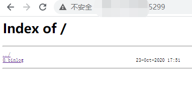

# 快速开始

## 1. 前置依赖

在使用本组件前，请确认系统环境已安装相关依赖软件，清单如下：

| 依赖软件 | 说明 |备注|
| --- | --- | --- |
| FISCO-BCOS | >= 2.6.0 | 需要为节点开启binlog选项|
| MySQL | >= mysql-community-server[5.7] | |
| Nginx | >= nginx[1.17.3]| |
| Bash | 需支持Bash|
| Java | JDK[1.8] | |
| Git | 下载的安装包使用Git | |


## 2. 基础设置

### 2.1. FISCO BCOS节点配置

由于全量数据服务用于生成节点的全量备份，所以要求节点拥有包括第一个区块在内的完整binlog日志，故需要确保该节点加入FISCO BCOS网络前就开启binlog生成选项。如果您的节点已经在运行中，请先停止该节点，并删除对应群组（以group1为例）的数据。例如：
```
[work@instance-zw7wgjv0 node0]$ bash stop.sh
 stop node0 success.
[work@instance-zw7wgjv0 node0]$ rm -rf data/group1

```

配置文件位于节点的conf/group.1.ini，请设置binary_log=true:

```
binary_log=true
```

配置完成后启动节点，使其加入FISCO BCOS网络：
```
[work@instance-zw7wgjv0 node0]$ bash start.sh
 node0 start successfully
```

启动成功后，即可在节点的data/group1/BinaryLogs目录下看到binlog，示例：

```
[work@instance-zw7wgjv0 node0]$ cd data/group1/BinaryLogs/
[work@instance-zw7wgjv0 BinaryLogs]$ ls
0.binlog
```

### 2.2. Nginx配置

FISCO BCOS节点的binlog日志存放在节点文件目录中，为了让外界能够访问这些binlog，现需要在节点所在服务器安装nginx并配置端口映射，这样外界即可根据该端口访问binlog。

若您还未安装nginx，请参考[附录](appendix.md)来安装nginx。

nginx配置文件位于/usr/local/nginx/conf/nginx.conf。需要在http模块内新增加一个server模块。在下面的模板中，请将端口号、服务器地址、binlog日志替换为实际的内容：

```
    server {
        listen       [端口号];
        server_name  [服务器地址];

        charset utf-8;
        location / {
            root   [binlog目录位置];
            index  index.html index.htm;
            autoindex on;
            autoindex_exact_size on;
            autoindex_localtime on;
        }

        error_page   500 502 503 504  /50x.html;
        location = /50x.html {
            root   html;
        }
    }
```

下面示例中，将5299端口映射到BinaryLogs目录：
```
    server {
        listen       5299;
        server_name  myhost.com;

        charset utf-8;
        location / {
            root   /home/work/fisco-bcos/nodes/127.0.0.1/node0/data/group1/BinaryLogs;
            index  index.html index.htm;
            autoindex on;
            autoindex_exact_size on;
            autoindex_localtime on;
        }

        error_page   500 502 503 504  /50x.html;
        location = /50x.html {
            root   html;
        }
    }
```

配置完成后，重启nginx使配置生效：

```
/usr/local/nginx/sbin/nginx -s stop
/usr/local/nginx/sbin/nginx -c /usr/local/nginx/conf/nginx.conf
/usr/local/nginx/sbin/nginx -s reopen 
```

这些操作完成后，可以通过浏览器访问该端口，出现类似下述响应即表示成功：



# 3. 启动服务

