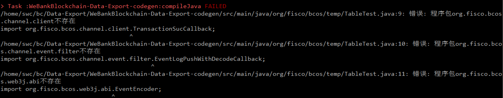

## 常见问题


### 为啥我的数据里自动生成的表里，只有block_detail_info、block_raw_data、block_task_pool、contract_info表有数据？

> 1. 区块链刚完成初始化，块高为0；
> 2. 数据导出合约Java文件的binary与上链文件的binary不一致，导致数据导出程序无法识别上链的合约数据。解决办法是，找到上链的代码，保证和数据导出里的bianry一致。例如，如果是通过java sdk来发送上链的，则将sdk中的合约java文件复制到数据导出工程中；如果是通过WeBASE-Front来发送的，则从WeBASE-Front中导出Java文件，并复制到数据导出工程中。然后，重新使用脚本重启即可。

### 我已成功启动和部署服务，也看到Mysql里生成了各个函数的表，但是只有event表里有数据，函数表里没有？

> A：同上一个问题。数据导出合约binary与上链文件的binary不一致，导致数据导出程序无法识别上链的合约数据。解决办法是，找到上链的代码，保证和数据导出里的bianry一致。例如，如果是通过java sdk来发送上链的，则将sdk中的合约java文件复制到数据导出工程中；如果是通过WeBASE-Front来发送的，则从WeBASE-Front中获取对应binary信息，并复制到数据导出工程中。然后，重新使用脚本重启即可。

### 数据导出按文档配置好后，本机运行报错，报错信息如下图，请问怎么办？



> A：如果报错信息中含有web3sdk字样，这是因为使用了web3sdk编译Java代码。请更新控制台，使用[2.6+控制台进行代码编译]( https://fisco-bcos-documentation.readthedocs.io/zh_CN/latest/docs/console/console_of_java_sdk.html) 。


### 数据导出的时候报错,"Could not find xxx.jar"，无法正常运行，错误信息参考如下：
```
FAILURE: Build failed with an exception.

* What went wrong:
Execution failed for task ':WeBankBlockchain-Data-Export-common:compileJava'.
> Could not resolve all files for configuration ':WeBankBlockchain-Data-Export-common:compileClasspath'.
   > Could not find java-sdk-2.6.1.jar (org.fisco-bcos.java-sdk:java-sdk:2.6.1).
     Searched in the following locations:
         http://maven.aliyun.com/nexus/content/repositories/jcenter/org/fisco-bcos/java-sdk/java-sdk/2.6.1/java-sdk-2.6.1.jar

* Try:
Run with --stacktrace option to get the stack trace. Run with --info or --debug option to get more log output. Run with --scan to get full insights.

* Get more help at https://help.gradle.org
```

> A：下载jar包失败。请首先检查报错的链接能否正常打开下载。如果正常，在项目根目录下执行下 `bash gradlew clean bootJar --refresh-dependencies` 强制重新刷新依赖。


### 假如我的合约升级了怎么办，能否导出历史和更新后的合约数据？

> A：可以。但是会被作为两个数据库表来进行存储，因为合约的数据结构等可能会改变。
操作方法：你也猜到了，我们建议建立版本号，将升级的合约与旧版本的合约Java文件，使用不同的命名，保存到配置文件下面。


### 是否支持合约函数和事件的重载？

> A：暂不支持，建议修改命名。

### 是否支持多群组的数据导出？

> A：支持
> 操作方法： [多群组数据导出](https://data-doc.readthedocs.io/zh_CN/latest/docs/WeBankBlockchain-Data-Export/install.html#id19)


### 脚本没权限，执行shell脚本报错误"permission denied"或格式错误？

```
## 赋权限
chmod + *.sh
## 转格式
dos2unix *.sh
```

### docker与数据库或链在一台机器上，docker无法访问宿主机

如果链或者数据库为本地安装，需查询本机ip，替换上述配置中的localhost 或者 127.0.0.1 地址。

启动脚本中已对本地ip进行了查询并替换，如果失败，可以按照下列命令查询并手动替换。

查询ip命令为：

```
   ifconfig | grep "inet " | grep -v 127.0.0.1
```

其中inet后的ip地址，即为本机ip


### centos启动脚本报yum更新失败
    
错误如：
```
yum更新失败：rpmdb: BDB0113 Thread/process 2673/140126198814528 failed: BDB1507 Thread died...
```
解决方式如下：
```
cd /var/lib/rpm
rm -rf __db*
rpm --rebuilddb
```

