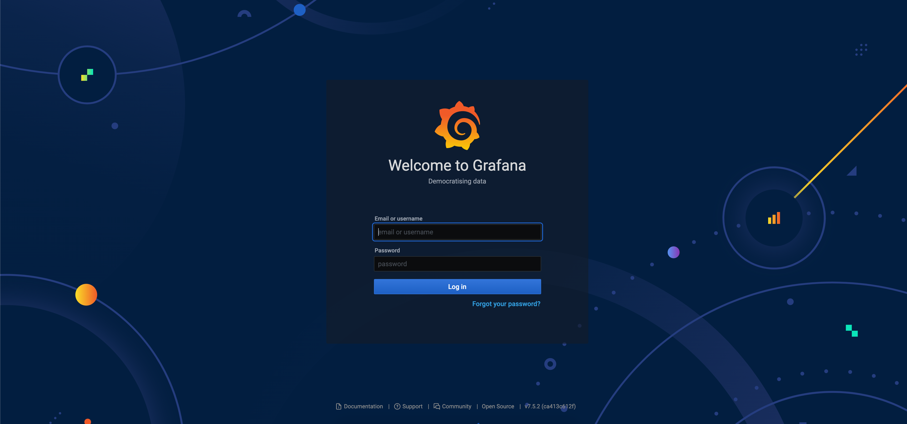
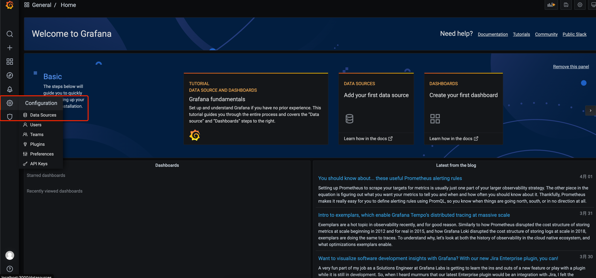
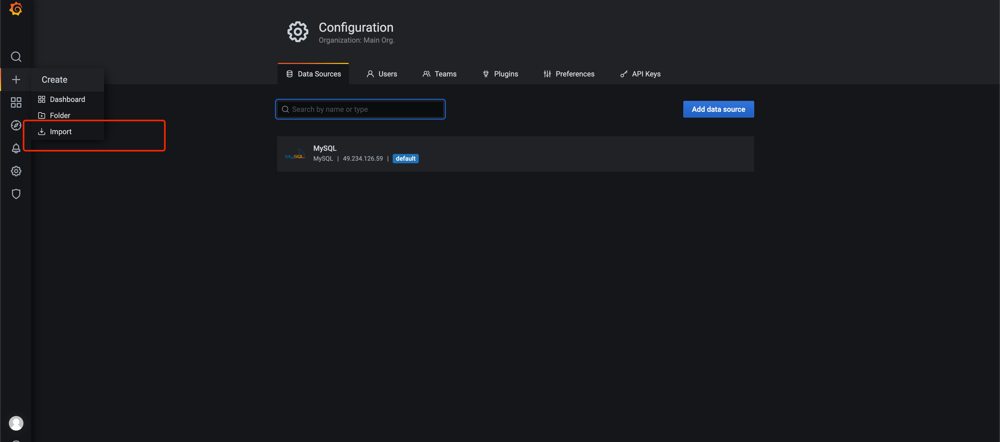
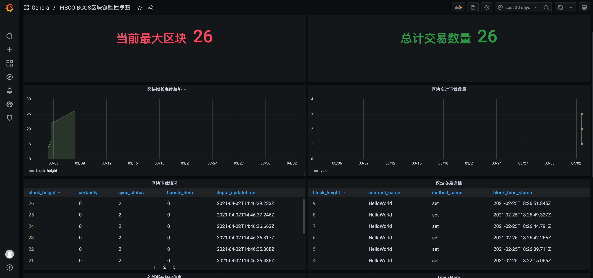

## 可视化配置

### 开启可视化

在application.properties中将grafana打开时，系统将会生成可视化json脚本 default_dashboard.json 文件，位于config目录下。

如果是docker方式启动，将在docker中自动部署grafana，通过[ip]:3000即可完成访问，无需手动安装，配置如下:

```
system.grafanaEnable=true
```

**当采用服务方式启动时，需手动安装，安装方式如下：**

#### 安装软件

首先，请安装docker，docker的安装可参考[docker安装手册](https://docker_practice.gitee.io/install/centos.html)
等docker安装成功后，请下载grafana：

```
docker pull grafana/grafana
```

如果你是使用sudo用户安装了docker，可能会提示『permission denied』的错误，建议执行:

```
sudo docker pull grafana/grafana
```

#### 启动grafana

```
docker run   -d   -p 3000:3000   --name=grafana   -e "GF_INSTALL_PLUGINS=grafana-clock-panel,grafana-simple-json-datasource"   grafana/grafana
```

grafana将自动绑定3000端口并自动安装时钟和Json的插件。


### 可视化展示配置

grafana安装并启动成功，通过访问[ip]:3000（本机则为localhost:3000）即可看到如下界面：
<br /> <br />

<br /> <br />

输入账密admin/admin, 现在跳过即可进入主界面，添加导出数据库的mysql信息，如下位置：
<br /> <br />

<br /> <br />

**如果是docker安装的mysql，添加mysql的host信息时，需先查询本机对外ip，方法见** [常见问题](./question.html#docker-docker)

添加mysql成功后，可通过如下方式导入系统生成的config/default_dashboard.json文件，如下位置：
<br /> <br />

<br /> <br />

导入成功后即可看到链的数据可视化情况，如下：
<br /> <br />

<br /> <br />

更多关于Grafana的自定义配置和开发文档，可参考[Grafana官方文档](http://docs.grafana.org/guides/getting_started/)
