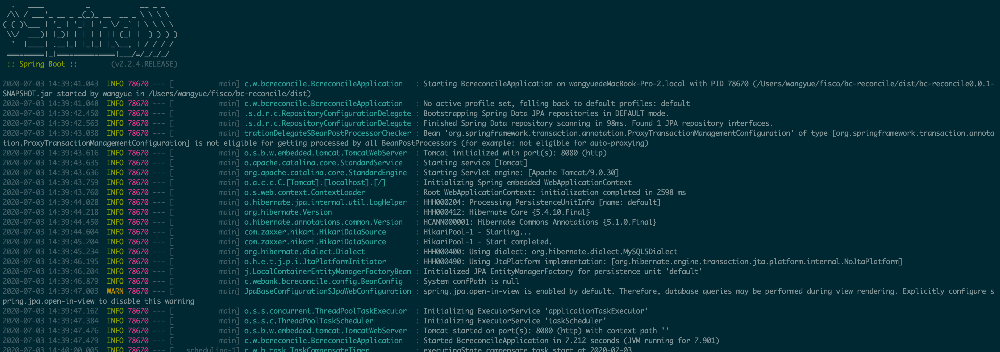
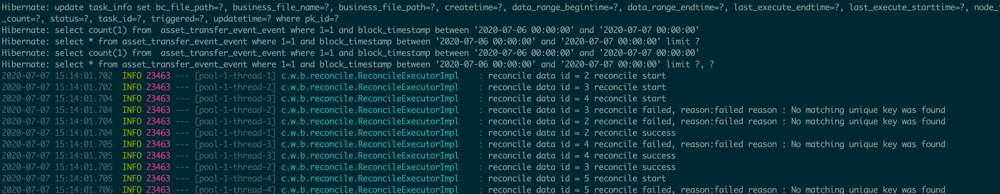

# 快速开始

## 1. 环境准备

在使用本组件前，请确认系统环境已安装相关依赖软件，清单如下：

| 依赖软件   | 说明                                                         | 备注 |
| ---------- | ------------------------------------------------------------ | ---- |
| FISCO-BCOS | \>= 2.0， 1.x版本请参考V0.5版本 dev分支                      |      |
| Bash       | 需支持Bash（理论上来说支持所有ksh、zsh等其他unix shell，但未测试） |      |
| Java       | \>= JDK[1.8]                                                 |      |
| Git        | 下载的安装包使用Git                                          |      |
| MySQL      | \>= mysql-community-server[5.7]                              |      |
| FTP        | 需要时安装                                                     |      |

## 2. 项目准备

### 2.1 下载代码：

```
git clone https://github.com/WeBankBlockchain/Data-Reconcile.git
cd Data-Reconcile
```
```eval_rst
.. note::
    - 如果因为网络问题导致长时间无法下载，请尝试：git clone https://gitee.com/WeBankBlockchain/Data-Reconcile.git
```

### 2.2 项目打包

```
./gradlew build
```

项目jar包在dist目录下，dist目录如下：
```
├── dist
│   ├── config
│   │   ├── application.properties
│   │   └── datasource.properties
│   │   └── filetransfer.properties
│   │   └── reconcile.properties
│   ├── start.sh
│   ├── stop.sh
│   └── Data-Reconcile-1.0.0-SNAPSHOT.jar
```

### 2.3 项目配置

配置文件位于dist/config目录下
```
├── dist
│   ├── config
│   │   ├── application.properties
│   │   └── datasource.properties
│   │   └── filetransfer.properties
│   │   └── reconcile.properties
```

#### 2.3.1 数据库配置

关于数据库的连接配置在datasource.properties下，将链上导出数据所在的数据库参数配置到这里，链上数据需要借助数据导出组件WeBankBlockchain-Data-Export对链上数据进行导出，数据导出组件使用：[WeBankBlockchain-Data-Export](https://data-doc.readthedocs.io/zh_CN/dev/docs/WeBankBlockchain-Data-Reconcile/install.html)

必配项如下：

```
## data export DB config
spring.datasource.url=jdbc:mysql://[IP]:[PORT]/[database]?useSSL=false&serverTimezone=Asia/Shanghai&useUnicode=true&characterEncoding=UTF-8
spring.datasource.username=[user_name]
spring.datasource.password=[password]

##生产环境下需关闭以下自动建表配置，手动建表
spring.jpa.hibernate.ddl-auto=update
```
```eval_rst
.. important::
   上述自动建表配置关闭时，需将下述sql在以上配置的数据库中执行，否则默认开启自动建表，无需执行该sql。
   对账任务表记录了对账任务的生命周期和流转状态
```

```
CREATE TABLE `task_info` (
  `pk_id` bigint(20) NOT NULL AUTO_INCREMENT,
  `node_id` varchar(255) NOT NULL DEFAULT '""',
  `task_id` varchar(255) NOT NULL DEFAULT '""',
  `status` tinyint(4) NOT NULL,
  `triggered` tinyint(4) NOT NULL,
  `business_file_name` varchar(255) DEFAULT NULL,
  `business_file_path` varchar(255) DEFAULT NULL,
  `bc_file_path` varchar(255) DEFAULT NULL,
  `result_file_path` varchar(255) DEFAULT NULL,
  `last_execute_starttime` timestamp NULL DEFAULT NULL,
  `last_execute_endtime` timestamp NULL DEFAULT NULL,
  `data_range_begintime` timestamp NULL DEFAULT NULL,
  `data_range_endtime` timestamp NULL DEFAULT NULL,
  `retry_count` int(11) DEFAULT 0,
  `createtime` timestamp NOT NULL DEFAULT '2019-05-21 00:00:00',
  `updatetime` timestamp NOT NULL DEFAULT CURRENT_TIMESTAMP ON UPDATE CURRENT_TIMESTAMP,
  PRIMARY KEY (`pk_id`),
  UNIQUE KEY `task_id` (`task_id`)
) ENGINE=InnoDB DEFAULT CHARSET=utf8;
```

#### 2.3.2 对账配置

对账配置reconcile.properties，包括对账任务调度配置和对账数据规则配置

##### 2.3.2.1 对账任务调度配置

对账任务配置及说明如下，配置项如下，其中必配项做了标记(Must)，可采用默认配置

```
#定时对账开关
reconcile.task.timer.enable=true
#定时对账数据时间范围（单位：天），如设置为1天，则对账数据时间范围为对账任务触发时间起过去一天数据
reconcile.task.time.range.days=1
#定时对账时间规则（对账时间点设置）
#Online build/parse: http://cron.qqe2.com/
#Commonly used: second, minute, hour, day, month, year
#默认配置为每隔1分钟执行一次，可根据实际场景按需配置
reconcile.task.time.rule=0 0/1 * * * ?

#对账任务超时时间（ms）
reconcile.task.timeout=600000
#对账任务失败重试间隔时间（ms）
reconcile.task.retry.interval.time=60000
#对账失败任务重试次数，若配置为0则关闭任务重试
reconcile.task.retry.count=0
#对账状态补偿时间规则（执行中）
reconcile.executing.compensate.rule=0 0/1 * * * ?
#对账状态补偿时间规则（失败）
reconcile.failed.compensate.rule=0 0/1 * * * ?

```
对账任务相关详情参考基础模块中[任务管理](https://data-doc.readthedocs.io/zh_CN/dev/docs/WeBankBlockchain-Data-Reconcile/model.html#id5)


##### 2.3.2.2 对账数据规则配置

对账数据规则配置及说明如下，配置项如下，其中必配项做了标记(Must)

```
#业务数据提供方机构名 (Must)
reconcile.business.name=webank

##数据导出sql配置，包含查询sql和时间参数字段配置 (Must)
#链上数据导出库表查询语句,格式：select * from table where ... and 1=1（不需要添加数据时间范围和分页条件）
#以数据导出库表block_tx_detail_info为例：select block_height,tx_from,tx_to from block_tx_detail_info where 1=1
reconcile.bc.reconcileQuerySql=select [field...] from [table] where 1=1

#数据导出库表数据查询时间范围字段 (Must)
#数据导出表的时间字段名，如果涉及多个表操作，请指出该字段属于哪个表，即添加字段前缀，如block_tx_detail_info.block_timestamp
reconcile.bc.QueryTimeField=block_timestamp

##默认对账模式配置:
#通用对账模式开关
reconcile.general.enabled=true
#业务数据文件格式, json or txt
reconcile.file.type=txt
#业务数据唯一键 (Must)
#唯一键用来匹配数据
reconcile.field.business.uniqueColumn=busId
#数据导出数据唯一键，与业务唯一键对应 (Must)
reconcile.field.bc.uniqueColumn=block_height
#两方数据字段匹配规则 (Must)
#格式以reconcile.fieldMapping作为前缀，reconcile.fieldMapping.业务方字段名=数据导出表字段名（唯一键映射无需再配），如下
#reconcile.fieldMapping.busId=block_height
#reconcile.fieldMapping.busFrom=tx_from
#reconcile.fieldMapping.busTo=tx_to
```
```eval_rst
.. important::
   开启默认对账后，对账字段映射规则字段为必配，业务对账文件中字段名和数据导出的字段名要对应。
```
对账配置更多说明参考[配置介绍](https://data-doc.readthedocs.io/zh_CN/dev/docs/WeBankBlockchain-Data-Reconcile/model.html#id5)


#### 2.3.3 文件传输配置

文件传输中心现支持本地或远程FTP两种模式,任选其一，默认配置为本地模式，可通过filetransfer.properties配置文件进行配置

#### 2.3.3.1 文件中心配置
将filetransfer.properties中local.enabled配置为true即可，ftp保持关闭
```
#localfile switch
local.enabled=true
#FTP switch
ftp.enabled=false
```

#### 2.3.3.2 FTP配置
ftp配置在 filetransfer.properties中，local.enabled设置为false，基本配置项如下：

```
#localfile switch
local.enabled=fasle

#FTP switch
ftp.enabled=true
ftp.host=127.0.0.1
ftp.port=21
ftp.userName=ftptest
ftp.passWord=123456
ftp.workDir=/home/upload
```

需自行搭建，推荐vsftp，参考链接：[ftp安装](https://data-doc.readthedocs.io/zh_CN/latest/docs/WeBankBlockchain-Data-Reconcile/appendix.html#ftp)

#### 2.3.4 对账数据准备

##### 2.3.4.1 业务方数据准备

如采用本地模式，需要预先将业务数据文件放至dist目录下；
如采用远程FTP模式，需要将业务数据文件推送至filetransfer.properties中配置的工作目录下（ftp.workDir配置目录）

业务对账文件命名规则为：业务数据提供方机构名_对账数据查询起始日期（如：webank_2020-11-19），机构名为对账配置reconcile.properties中的机构名，如webank。

测试时，为简化操作，可自建对账文件，文件名根据reconcile.properties配置中reconcile.task.time.range.days天数计算得到，如当前日期为2020-11-20，reconcile.task.time.range.days配置为1，则对账文件命名为：webank_2020-11-19

业务对账文件支持txt和json格式

**txt文件格式如下：**

```
block_height#_#tx_from#_#tx_to#_#
1#_#..#_#...#_#
2#_#..#_#...#_#
3#_#..#_#...#_#
```
格式说明：首行不可为空行，首行为对账字段，要与对账配置reconcile.properties中reconcile.fieldMapping设置字段对应，字段分隔符为#_#。

同时，也可自行通过代码定义字段和数据，组件提供txt格式文件的生成方法，在src/mian/java/com/webank/blockchain/data/reconcile/utils/FileUtills工具类中，
如下：
```
//数据写入新文件中
public static <T> File exportDataByTxtFormat(List<T> dataList, String filePath)

//append为true时，数据追加到文件末尾
public static <T> File exportDataByTxtFormat(List<T> dataList, String filePath,
boolean append) 
```

可以根据不同需求通过上述工具方法，定义业务对账文件字段和数据，并导出为文件，同时定义数据对象时，应实现toString()方法

以数据导出库表block_tx_detail_info为例，业务数据字段可定义如下：
```
    public void exportDataUtilTest() throws Exception {
        List<ExportData> dataList = new ArrayList<>();
        ExportData data1 = new ExportData(1, "..", "...");
        ExportData data2 = new ExportData(2, "..", "...");
        dataList.add(data1);
        dataList.add(data2);
        FileUtils.exportDataByTxtFormat(dataList,"out/export.txt");
    }

    static class ExportData{
        long busId;
        String busFrom;
        String busTo;
        public ExportData(long busId, String busFrom, String busTo) {
            this.busId = busId;
            this.busFrom = busFrom;
            this.busTo = busTo;
        }
    }
```


**json格式文件如下：**

```
[{"busId":"2","busFrom":"10","busTo":"sjj"},{"busId":"3","busFrom":"10","busTo":"sjj"}]
```
格式说明：json采用通过格式，可通过Jackson等工具包生成，这里不再赘述。

以上为业务方数据准备。


## 3.  项目启动


### 项目启动

执行dist/目录下的start脚本
```
cd dist && bash start.sh
```

 启动成功日志如下：




对账执行结果文件保存在dist/out/result/下，如开启远程FTP模式，则将结果文件推送到远程FTP。

执行日志如下：




执行结果本地保存在/dist/out/result目录中：

```
├── out
│   ├── bc
│   │   ├── BC_yyyy-MM-dd.txt
│   ├── business
│   │   ├── company_yyyy-MM-dd.txt
│   ├── result
│   │   ├── result_company_yyyy-MM-dd.txt
```

执行日志保存在logs目录下


## 4. 项目扩展

支持业务根据自身需求对组件进行扩展，组件核心流程位于src/main/java/com/webank/blockchain/data/reconcile/handler目录下，如下：

```
├── handler
│   ├── executor
│   │   ├── DefaultReconcileExecuteHandler.java
│   │   └── ReconcileExecuteHandler.java
│   ├── filesource
│   │   ├── DefaultReconcileFileObtainHandler.java
│   │   └── ReconcileFileObtainHandler.java
│   ├── finish
│   │   ├── DefaultReconcileResultHandler.java
│   │   └── ReconcileResultHandler.java
│   ├── task
│   │   └── ReconcileTaskHandler.java
│   ├── Handler.java
│   ├── InvocationHandler.java
│   └── ReconcileHandlerFactory.java
```

对账流程默认分为四步：

1.任务管理，为执行责任链的首端，负责对账任务调度管理，任务模块由组件负责管理。

2.对账文件获取，分为业务对账文件和链上数据文件获取，提供两个扩展接口，如下，并提供默认实现，使用者可根据自身需要对接口进行实现

```
//链上数据导出，默认提供txt，json实现
public interface BCDataExportService{
    File exportData(String filePath, Date dataRangeBeginTime, Date dataRangeEndTime);
}
//业务对账文件获取,默认提供FTP文件获取实现
public interface FileTransferService {
    String sendFile(File file) throws Exception;
    File obtainFile(String fileName, String localFilePath) throws IOException;
}
```

3.对账执行，分为文件解析和数据对账处理，提供两个扩展接口，如下，并提供默认实现

```
//文件解析，默认提供txt，json实现
public interface FileParser {
    void parseAndTransfer(File businessReconFile, File bcReconFile, ReconcileTransfer transfer) throws ReconcileException;
}
//对账处理，提供通用对账逻辑实现
public interface ReconcileExecutor{
    ReconcileResult execute(ReconcileExecuteData executeData);
}
```

4.结果处理，包括结果导出和推送，提供扩展接口如下，并提供默认实现

```
//结果导出文件，默认提供txt，json实现
public interface ResultDataExportService {
    File exportResultData(String filePath, List<Future<ReconcileResult>> reconcileResults);
}
```

以上是对账核心流程。

另外，也可对核心流程功能进行增删扩展，提供流程处理扩展接口如下：

```
public interface Handler {
    void invoke(ReconcileContext context, InvocationHandler handler) throws Exception;
}
```

流程管理在ReconcileHandlerFactory类中，可在该类中对流程步骤进行扩展管理。