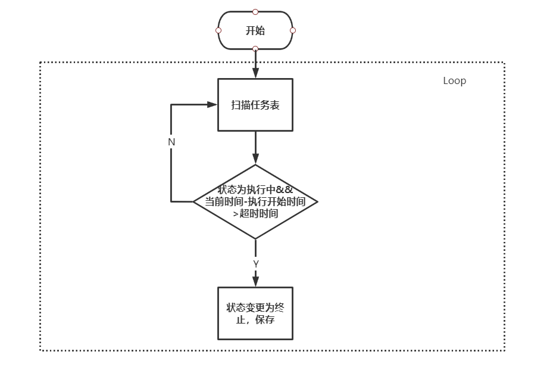
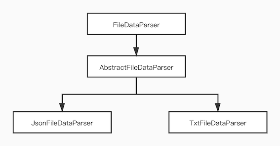

# 组件设计

## 1.整体架构

区块链对账组件整体架构如下图所示。主要包括：基础模块、对账数据传输模块、对账消息模块、对账执行模块。


​                        


各模块功能概要如下：

1. 基础模块负责对上层业务模块的技术支持，提供了网络传输、任务管理、配置管理、文件管理等能力。
2. 对账数据传输模块负责业务和链上数据的获取和对账文件的推送。
3. 对账消息模块负责与业务方的通信，包含了对账请求和对账结果通知等功能。
4. 对账模块负责对账的具体执行和处理，包含文件解析、数据提取、对账处理、结果导出等功能。

## 2. 业务流程

流程图如下图所示，业务方将对账文件发送给对账方，对账方可以通过定时任务或者主动调用的方式开启对账任务，其中主动调用分两种方式：一种是对账方手动调用，另一种是业务方发送对账请求。任务首先会先从文件资源中心（如FTP）拉取业务方对账文件，然后将链上数据导出为文件，进行对账，并将对账结果生成文件推送给业务方，任务完成。

​                      


对账方和业务方关系如下，该组件服务为对账方使用。

​                        

## 3. 模块设计

对账组件各功能模块采用责任链模式连接，可插拔，可扩展。


接口关系如下：

​                        


调用时序如下：

​                        


### 3.1 基础模块

基础模块提供网络传输、任务管理、配置管理、文件管理等能力。

#### 3.1.1 配置管理

配置管理负责对于对账方配置文件的读取管理。

##### 3.1.1.1 DB配置

DB配置位于resource目录下datasource.properties文件，用于数据库的连接配置，主要包括了对账方数据库url、username、password、database等配置，其中还有用于数据导出文件的sql配置。


具体配置如下：


```
## data export DB config
spring.datasource.url=jdbc:mysql://127.0.0.1:3306/test?autoReconnect=true&characterEncoding=utf8&useSSL=false&serverTimezone=GMT%2b8
spring.datasource.username=root
spring.datasource.password=123456
```


##### 3.1.1.2 传输配置

传输配置包含了文件传输和消息传输中间件的配置，这里默认采用ftp来完成文件的传输，ftp配置位于resource目录下ftp.properties文件，用于FTP的连接配置，主要包括ip地址、端口号、username、password等配置。


配置如下：


```
ftp.enabled=true
ftp.Host=192.168.xx.xx
ftp.Port=21
ftp.UserName=root
ftp.PassWord=root
```


PS：消息中间件可按需增加配置。

##### 3.1.1.3 对账配置

对账配置位于resource目录下reconlie.properties文件，提供对账任务和对账规则映射配置。


配置如下：


```
#定时对账开关
reconcile.task.timer.enable=true
#定时对账数据时间范围（单位：天）
reconcile.task.time.range.days=0
#定时对账时间规则
#Online build/parse: http://cron.qqe2.com/
#Commonly used: second, minute, hour, day, month, year
reconcile.task.time.rule=0 0 1 * * ?

#对账任务超时时间（ms）
reconcile.task.timeout=600000
#对账任务失败重试间隔时间（ms）
reconcile.task.retry.interval.time=60000
#对账失败任务重试次数
reconcile.task.retry.count=2
#对账状态补偿时间规则（执行中）
reconcile.executing.compensate.rule=0 0/1 * * * ?
#对账状态补偿时间规则（失败）
reconcile.failed.compensate.rule=0 0/1 * * * ?

#业务数据提供方机构名 (Must)
reconcile.business.name=webank

##数据导出sql配置，包含查询sql和时间参数字段配置 (Must)
#data query sql，format：select * from table where ... and 1=1（There is no need to add a data time range and paging criteria）
reconcile.bc.reconcileQuerySql=select * from asset_transfer_event_event where 1=1
#The time field name of the data export table， If multiple table operations are involved,
#please indicate which table it belongs to, that is, add the field prefix, such as table.timeField (Must)
reconcile.bc.QueryTimeField=block_timestamp

##默认对账模式配置:
#通用对账模式开关
reconcile.general.enabled=true
#业务数据文件格式, json or txt
reconcile.file.type=txt
#业务数据唯一键 (Must)
reconcile.field.business.uniqueColumn=orderId
#BC数据唯一键，与业务唯一键对应 (Must)
reconcile.field.bc.uniqueColumn=pk_id
#两方数据字段匹配规则，格式如下 (Must)
#reconcile.fieldMapping.busId=bcId
#reconcile.fieldMapping.busName=bcName
#reconcile.fieldMapping.busAccount=bcAccount
reconcile.fieldMapping._from_account=fromAccount
reconcile.fieldMapping._to_account=toAccount
reconcile.fieldMapping._amount=amount
```


##### 3.1.1.4 系统配置

系统配置位于resource目录下application.properties文件，用于组件的基础配置，包括项目名称,日志等设置。配置如下：


```
system.name=
logs...
```


#### 3.1.2 网络传输

网络传输提供文件和消息的传输功能。

##### 3.1.2.1 文件传输

文件传输负责业务对账文件和对账方对账结果的传输，核心接口如下：


```
public interface FileTransferService {

    String sendFile(File file) throws Exception;
    File obtainFile(String fileName, String localFilePath);

}
```


这里提供默认实现，采用FTP来作为文件资源存储中心，来实现对账方和业务方的文件传输。实现类如下：


```
public class FtpServiceImpl implements FileTransferService {
    @Autowired
    FTPConfig config;
    @Autowired
    FtpPool pool;
    ...
    ...
}
```


##### 3.1.2.2 消息传输

消息传输负责与业务方的消息通信，提供两种方式，这里默认采用HTTP交互，另外提供mq的消息处理接口，可扩展，接口如下：


```
public interface NoticeService <T,S>{

    void  receiveMsg(T t);

    void  sendMsg(S s);

}
```


#### 3.1.3 文件管理

文件管理提供对于对账文件的管理和读写。

##### 3.1.3.1 文件读写

提供对于对账文件的读写能力，文件格式通过对账配置可获得，包括了业务对账文件的读取、对账结果文件和BC数据导出文件的写入功能。

##### 3.1.3.2 文件存储

网络下载的文件和对账结果文件的保存，统一保存在/out目录下，并通过FileManager来完成文件的管理。

#### 3.1.4 任务管理

任务管理负责对账任务的调度执行，包括了定时任务和手动触发模式，另外还有对于任务的失败补偿。

任务表预先在对账方DB中创建，任务信息表（task_info）结构如下:


| 字段名            | 类型    | comment                                       |
| ---------------------- | ------------ | ------------------------------------------------- |
| pkId                   | bigInte(20)  | 主键id                                            |
| task_id                | varchar(255) | 任务序列Id，唯一键                                |
| node_id                | varchar(255) | 任务节点标识                                      |
| triggered              | thinint(4)   | 触发方式，1-定时任务 2-手动                       |
| business_file_name     | varchar(255) | 对账文件名                                        |
| business_file_path     | varchar(255) | 业务对账文件路径                                  |
| bc_file_path           | varchar(255) | BC对账文件路径                                    |
| result_file_path       | varchar(255) | 对账结果文件路径                                  |
| status                 | thinint(4)   | 0-待执行；1-执行中；2-已完成；3-执行失败； 4-终止 |
| last_execute_starttime | timestamp    | 末次执行开始时间                                  |
| last_execute_endtime   | timestamp    | 末次执行结束时间                                  |
| retry_count            | thinint(4)   | 重试次数                                          |
| createtime             | timestamp    | 创建时间                                          |
| updatetime             | timestamp    | 更新时间                                          |


任务状态对应场景：


| 待执行-0（初始态）   | 任务创建时                 |
| -------------------- | -------------------------- |
| 执行中-1 （中间态）  | 流程开始时                 |
| 已完成-2（终态）     | 对账完成时                 |
| 执行失败-3（中间态） | 异常                       |
| 结束终止-4（终态）   | 任务超时、重试次数达到上限 |


状态流转：


```
1.INIT -> EXECUTING -> SUCCESS
2.INIT -> EXECUTING -> FAILURE -> SUCCESS
3.INIT -> EXECUTING -> FAILURE -> TERMINATE
```


##### 3.1.4.1 定时任务

根据对账中任务配置来开启定时任务，创建任务开始对账流程。定时任务类如下：


```
public class ReconcileTaskTimer {
   @Scheduled(cron = "${task.time.rule}")
   public void execute() {
       ...
    }   
}
```


##### 3.1.4.2 任务补偿

对账任务中间态的补偿，这里包含了任务的超时时间和重试次数的限制，可配置，单独开启线程扫描失败任务，进行重试。任务补偿类如下，包含对**执行失败状态**和**执行中**的两种中间态补偿


```
public class TaskCompensate {
    public void executingStateCompensate(){}
    public void failedStateCompensate(){}
}
```


失败状态的补偿流程如下：

​                        


执行中任务的补偿如下：

​                        


### 3.2 对账数据模块

对账数据模块负责对账方和业务方的对账数据传输。

其中对账源文件的获取通过以下抽象类实现：


```
public abstract class ReconcileFileObtainHandler implements Handler {

    @Override
    public void invoke(ReconcileContext context, InvocationHandler handler) throws Exception {
       ....
       ....
    }

    abstract File getBCReconcileFile(TaskInfo taskInfo) throws Exception;

    abstract File getBusinessReconcileFile(TaskInfo taskInfo) throws Exception;

}
```


#### 3.2.1 业务对账文件获取

这里会每次开启任务都会到文件资源中心（如FTP）中获取业务对账文件，对账文件的命名规则为：业务方机构名称_对账数据启示日期（提供以天为单位的实现），业务机构名可在对账配置中读取。格式如下：


```
webank_2020-05-22
```


实现方法如下:


```
 abstract File getBusinessReconcileFile(TaskInfo taskInfo)
```


文件格式默认支持txt，json。

对于数据导出txt文件，提供了数据导出的工具类，在utils/FileUtils下。


```
//数据写入新文件中
public static <T> File exportDataByTxtFormat(List<T> dataList, String filePath)

//append为true时，数据追加到文件末尾
public static <T> File exportDataByTxtFormat(List<T> dataList, String filePath,
boolean append) 
```


#### 3.2.2 BC数据导出

数据按配置sql取链上数据，导出为文件，格式为txt，查询范围根据业务对账文件名中时间范围类取数据。


实现方法如下：


```
abstract File getBCReconcileFile(TaskInfo taskInfo)
```


#### 3.2.3 对账结果处理

对账方将对账结果导出为文件，并发给业务方。

核心接口如下：


```
public class ReconcileResultHandler implements Handler {
    @Override
    public void invoke(ReconcileContext context, Handler handler) {}
    abstract File exportData(Map<String,ReconcileResult> reconcileResults) throws Exception;

    abstract void transferResultFile(File file) throws Exception;
}
```


导出文件提供了扩展接口如下，并提供json和txt的默认实现


```
public interface ResultDataExportService {

    File exportResultData(String filePath, Map<String, ReconcileResult> reconcileResults) throws IOException;
}
```


### 3.3 对账消息模块

对账消息模块负责业务方与对账方的消息交互，业务方可主动发起对账，并查询对账结果

默认采用HTTP实现，接口如下：


```
@RequestMapping("reconcile/")
public class ReconcileController {

    @RequestMapping(value = "getReconcileResult")
    public void getReconcileResult(@RequestParam(name =         "fileName") String fileName){}

    @RequestMapping("requestReconcile")
    public void requestReconcile(@RequestParam(name = "fileName") String fileName){}
}
```


可以通过NoticeService 扩展接口实现mq消息传输，该功能可根据具体业务场景选择。


##### 3.3.1 对账请求

业务方可主动发起对账请求，通过上述requestReconcile接口可实现业务方触发对账功能。


##### 3.3.2 结果通知/查询

业务方可通过getReconcileResult查询对账任务执行结果，返回对账结果文件路径等结果信息。

### 3.4 对账模块

对账模块负责对账文件的解析、数据提取配对、对账执行、对账结果处理等功能。


核心接口：


```
public class ReconcileExecuteHandler implements Handler {
    @Override
    public void invoke(
    ReconcileContext context, Handler handler) {
    }
    abstract Map<String,ReconcileResult>     parseAndExecute(File businessReconFile, File bcReconFile) throws ReconcileException;

}
```


##### 3.4.1 文件解析

文件解析负责对账文件的解析处理。调用模板方法:


```
  abstract Map<String,ReconcileResult> parseAndExecute(File businessReconFile, File bcReconFile) 
```


并发解析两方对账文件，并调用数据提取的接口，获得数据。文件解析接口关系图如下：

​                        


这里提供两种默认实现Json和txt，其中txt内容格式如下，字段之间#_#

间隔，数据按行\n区分，每行为一条对账数据。


```
#_#pk_id#_#block_height#_#certainty#_#
#_#5330#_#12329#_#1#_#
#_#5329#_#12328#_#1#_#
#_#5328#_#12327#_#1#_#
```


Json文件格式：


```
{"id":"123","success":true,"failReason":null}
```


##### 3.4.2 数据转发

将解析配对后的数据交给执行器处理，实现解析和执行的解耦

接口如下：


```
public interface ReconcileTransfer {

    void transferToExecutor(List<ReconcileExecuteData> executeData);

    Map<String,ReconcileResult> getReconcileResult();

}
```


##### 3.4.3 对账执行

根据对账规则进行对账处理，并将结果缓存。

核心接口：


```
public interface ReconcileExecutor{

    void execute(List<ReconcileExecuteData> executeData, Map<String,ReconcileResult> resultMap);

}
```


## 4. 组件扩展

流程扩展接口:


| Handler           | 对账流程处理接口，默认分为四步 |
| ----------------- | ------------------------------ |
| InvocationHandler | 处理链调用接口                 |


当前默认流程中提供了一些可扩展的接口，扩展接口列表如下：


| FileTransferService     | 文件传输接口，提供ftp的默认实现       |
| ----------------------- | ------------------------------------- |
| NoticeService           | 消息传输接口，用于mq消息传输          |
| FileParser              | 文件解析接口，提供txt、json的默认实现 |
| ReconcileExecutor       | 对账执行接口，提供默认实现            |
| ResultDataExportService | 对账结果导出接口，提供txt、json实现   |