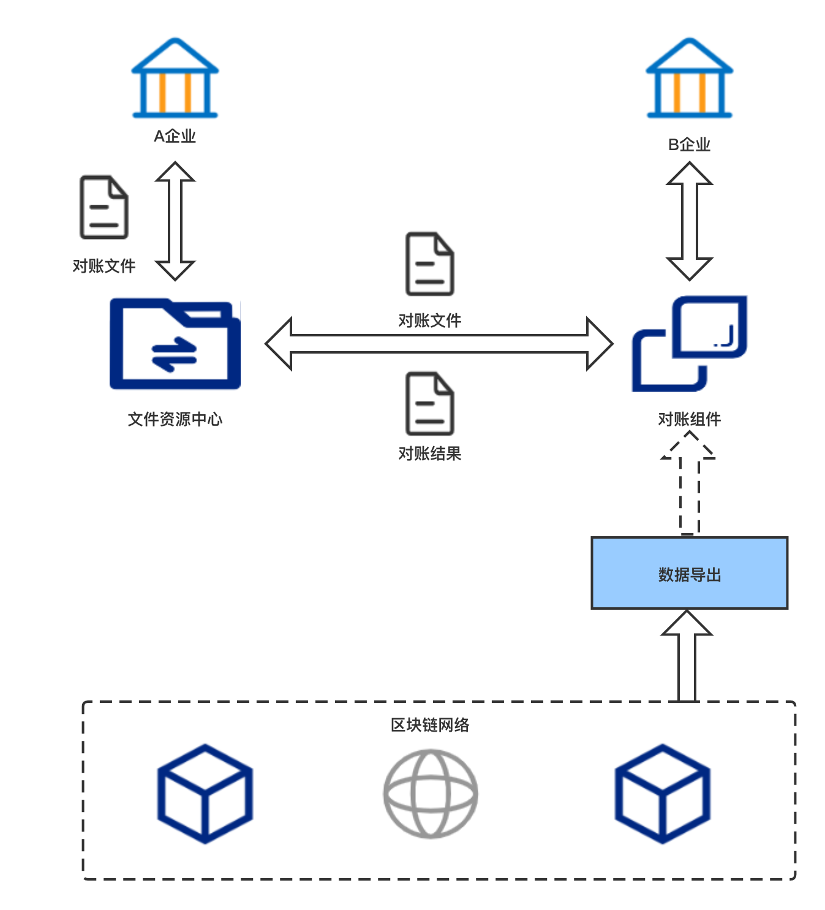
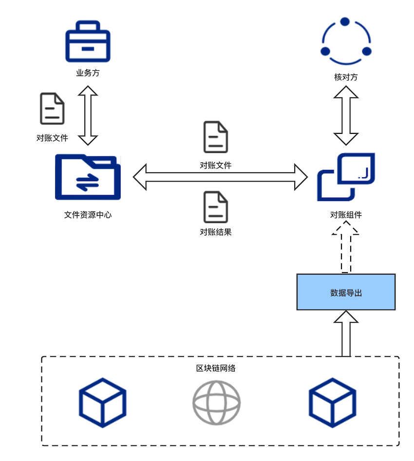

## 组件介绍

### 1. 组件介绍

传统企业间的对账，依赖于对账双方的中心化账本。中心化账本在对账期间如果出现账不平的情况，排查非常耗时耗力。区块链作为信任的机器，具有不可篡改、分布式账本等特性，基于区块链的对账能够在对账不一致的情况下，找到一个可信的客观依据，从而减少因对账不平造成的排查成本。
WeBankBlockchain-Data-Reconcile是一款基于区块链的对账组件，提供基于区块链智能合约账本的通用化数据对账解决方案，并提供了一套可动态扩展的对账框架，支持定制化开发。

### 2. 使用场景

#### 2.1 案例 企业间对账

企业A和企业B之间作为合作者，存在转账交易等数据交互行为，两者通过FISCO-BCOS搭建了区块链，并将各自的交易数据上传到链上，在结算时，A企业定期将自身业务系统交易数据导出为对账文件，发送至与文件资源托管中心，B企业并通过数据导出组件WeBankBlockchain-Data-Export导出链上数据至数据库中，并借助WeBankBlockchain-Data-Reconcile对账组件定期拉取A企业对账文件，与导出的链上数据进行对账处理，同时通过扩展接口对组件进行定制化开发，以满足不同对账需求。企业之间通过使用WeBankBlockchain-Data-Reconcile在保证对账结果可信的同时提升了对账的效率。

#### 2.2 案例 企业内部对账

企业内部通过FISCO-BCOS搭建了区块链，业务数据不仅保存在业务系统内部，同时也上传到链上，保证数据的不可篡改，由于业务系统可能存在人为篡改或数据故障等情况出现，需定期对业务系统数据进行核算检查，借助WeBankBlockchain-Data-Reconcile将业务系统数据和链上数据进行核算比对，保证企业内部业务系统数据的可靠和运行安全。

### 3. 特性介绍

 WeBankBlockchain-Data-Reconcile是一个具备轻量化，高性能，强扩展性的功能性中间件，配置方便，并从技术层面确保性能，如文件读写的异步处理、多线程处理等，并在处理流程中提供多接口，用于功能扩展，可插拔，同时支持外部集成封装，可根据不同场景定制开发。WeBankBlockchain-Data-Reconcile具备以下关键特性

#### 3.1 支持自定义对账数据结构

对账数据格式可根据需求进行自定义设置

#### 3.2 支持自定义对账规则

字段映射结构、对账处理等逻辑可动态扩展

#### 3.3 支持多种对账文件格式

如txt、json等，同时提供了扩展接口，可定制开发支持更多格式

#### 3.4 支持自定义对账任务和方式

调用方式包括手动或自动，任务频次、时间可配置

#### 3.5 支持多种对账文件托管方式

默认支持FTP，同时提供传输接口，可扩展更多托管方式

#### 3.6 对账处理流程可定制化开发

提供扩展接口，易于动态扩展和定制开发

