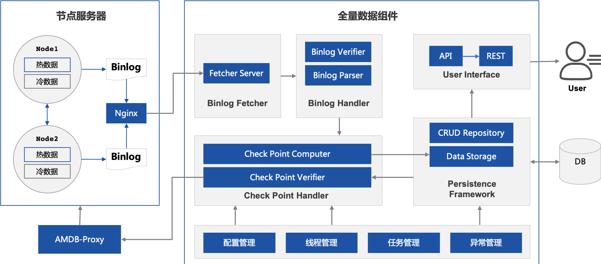
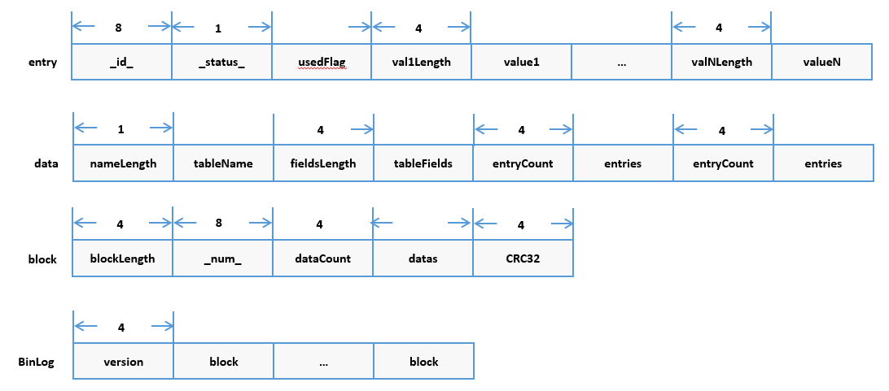

# 运行原理

## 1. 整体架构

整个体系分为如下部分：

### 1.1. 节点服务器

节点服务器相关的组件包括：

#### 1）FISCO BCOS节点

FISCO BCOS节点的账本按照mysql存储。每次新增加一个区块，都会为mysql里添加一些数据。mysql表的变化会被记录到binlog中。binlog目录被放在data/groupX/BinaryLogs目录下，x表示群组号：

#### 2）Nginx
FISCO BCOS节点本身并不会暴露binlog，如果希望外界读取到binlog，需要借助nginx。通过在nginx中配置端口和binlog目录的映射，外界就可以通过该端口访问到binlogs。
### 1.2. 全量数据组件

全量数据服务自身由如下几个部分构成：
#### 1）下载服务Fetcher Server
下载服务会持续轮询nginx端口，下载最新binlog日志到本地目录中。
#### 2）解析服务Binlog Parser
解析服务持续读取未解析binlog日志，将每个区块对应的mysql变动条目都解析出来。
#### 3）校验服务Binlog verifier
校验服务用于保证数据的可信性。校验服务会从其他节点拉取binlog进行对比，保证内容的一致性。同时，还会对数据本身进行校验，例如对于区块哈希校验、区块签名校验、交易根校验等。
#### 4）存储服务Data Storage
存储服务按照binlog的变动，会将其内容应用到数据库中，使数据库形成节点状态的一致、全量的冷数据库。
#### 5）检查点服务Checkpoint Handler
每一个区块数据的入库存储，都会生成一个检查点数据，该检查点包含了前置所有区块数据的哈希，用于额外对存储进行增信。

## 2. Binlog结构
一个Binlog记录了各区块对数据的信息。Binlog文件会包含起始区块高度，例如"4.binlog"表示该日志的首个区块为4。
FISCO BCOS采用了Binlog内部记录了每个区块导致哪些系统表被改变。数据的变动按照表(table)-行(entry)-列（fields）的结构组织。
Binlog的结构如下：

## 3. 存储模型

| 表 |表作用| 字段 | 字段说明 |
| --- | --- | --- | --- |
|_sys_config_|存储需要共识的群组配置项	|name,value,enable_num|配置名称，配置值，该条记录生效块高|
|_sys_cns_|存储合约名到地址的映射关系	|name,version,address,abi|合约名，合约版本，合约地址，合约ABI|
|_sys_consensus_|存储共识节点和观察节点的列表|name,type,node_id,enable_num|用于全量查询的标记，节点类型，节点ID，该条记录生效块高|
|_sys_current_state_|存储链最新的状态	|key,value|状态项（目前有current_number/total_transaction_count），状态值|
|_sys_table_access_|存储每个表的具有写权限的外部账户地址|table_name,address,enable_num|表明，账号地址，该条记录生效块高|
|_sys_tables_|存储所有表的结构|table_name,key_field,value_field|表名，表主key的列名，表其他列的列名|
|_sys_tx_hash_2_block_|存储交易hash到区块号的映射	|hash,value,index|交易hash，交易所在的区块号，区块中第几条交易|
|_sys_number_2_hash_|存储区块号到区块hash的映射	|number,value|区块号，区块hash|
|_sys_block_2_nonces_|存储区块中交易的nonces		|number,value|区块号，该区块中的nonce列表|
|_sys_hash_2_block_|存储区块hash到区块数据的映射	|key,value|区块hash，区块序列化数据|
|_sys_hash_2_header_|存储区块哈希对应的区块头数据|hash,value,sigs|区块hash，区块头序列号数据，签名列表|
|c_[合约地址]|存储外部账户信息|key,value|记录项（目前有balance/nonce/code/codeHash/alive），记录值|

## 4. 数据检查逻辑

全量数据服务会对binlog进行校验。校验分为两类：
- 对比校验
- 区块链校验

### 4.1. 对比校验

全量数据服务会从多个节点拉取binlog，并对这些binlog进行对比。针对每一个区块，校验内容包括：
- 区块高度相同
- 变动的表相同，包括表的数量和表名
- 每个表中的每一条记录(EntryInfo)都相同，包括检查每条行(ColumnInfo)都相同

### 4.2. 区块链校验

全量数据服务还会检测区块链数据本身，包括：

- blockHash：根据区块计算hash，看是否一致
- parentHash：区块能否链接到上一个区块
- sigList: 验证区块打包者的签名是否正确
- blockNumber：校验区块高度
- timestamp：校验区块时间
- transaction：根据blockLimit，判断是否超时
- stateRoot校验：transactions的stateRoot是否与header中一致

