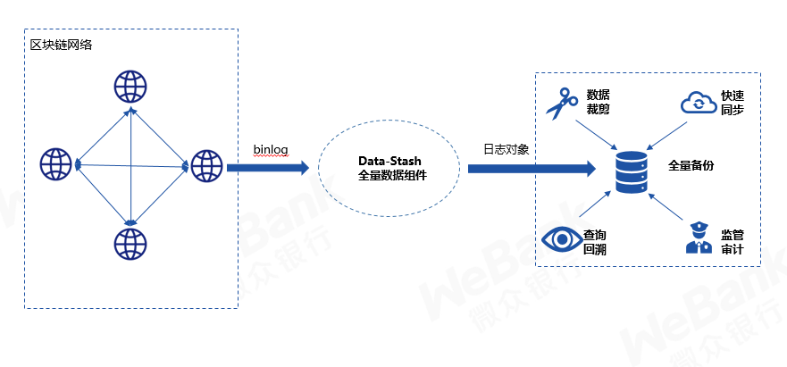
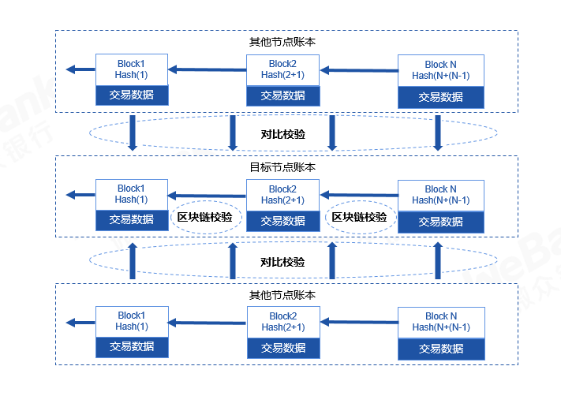

# 组件介绍

自区块链诞生以来，如何以有限的磁盘空间来存储无限膨胀的账本数据，一直是区块链数据治理领域的痛点。针对这一痛点，自FISCO BCOS 2.6版开始，我们开发了数据仓库组件Data-Stash，以解决账本和磁盘之间的矛盾。通过为节点生成全量备份作为后备保障，使节点便可以放心地进行数据裁剪，而不必担心数据丢失。Data-Stash还可以用于节点快速同步、监管审计等场景。

## 1. 关键特性
### 1） 节点账本全量备份
数据仓库组件拥有将节点账本完整备份到第三方存储的能力，从而可以满足多方面的需求。首先，有了完整的第三方备份，节点就可以清理掉不必要的账本信息，为磁盘腾出出空间。此外，该备份是和节点自身的账本数据高度兼容的，通过将全量备份连接到节点存储模块，实现节点账本的“神同步”，可以应用于节点迁移等场景。最后，全量备份采用关系型数据库存储，从而满足多样化的查询需求。

### 2）多维度账本校验
数据仓库组件在读取某节点的日志后，会进行多重校验，以防止节点账本信息被损害、被篡改、共识系统异常等情况。检测是多维度的，整体可分为对比校验和区块链校验。对比校验是指数据仓库组件会拉取多个节点的账本对比其内容，账本信息一致后才可以入库；区块链校验是指对账本数据的校验，例如区块之间按哈希构建成链、区块签名合法、交易状态根一致等。

### 3）备份数据可信存储
每次处理完成一个区块，数据仓库组件都会为此时刻的全量备份生成一个哈希值作为检查点。该检查点用于为存储增信，适用于全量备份库之间的校验等场景。例如比如不同机构生成了各自的全量备份，现在想比对各自备份数据是否一致，只需要提取出最新区块高度的检查点进行比对，如果一致，则表示备份内容完全相同；如果不一致，可以通过二分查找的方式找到不一样的区块，以进一步分析差异。
### 4）断点续传
在实际运行中，FISCO BCOS会生成许多binlog，这些binlog无论是大小、数量，都具有相当规模，如果每一次运行都重复下载、解析，会造成极大的性能浪费。为此，我们设计了断点续传机制，我们会持续记录解析的进度，每一次运行的时候都会从上一次断点处运行，而不会重新开始。
### 5）易于使用
使用者只需要做少量的配置，就可以运行。可以通过jar包直接运行，也可以通过bash脚本启动。
## 2. 使用场景
### 1） 通过裁剪实现瘦身
随着时间的推移，节点会积累越来越多的账本数据，如果账本的体积不受控制的增长，最终会把节点所在服务的磁盘侵蚀殆尽，导致整个节点不可用。运维人员可以使用数据仓库组件来为节点瘦身，首先准备好一个容量充足的第三方数据库，然后运行数据仓库组件将账本导入到该数据库中实现备份，这样就可以删除本地的账本数据了。冷数据导回节点可见[fisoc-sync工具](https://fisco-bcos-documentation.readthedocs.io/zh_CN/latest/docs/manual/data_governance.html#fisco-sync)
### 2） 通过"神同步"实现迁移
在区块链业务运行的时候，经常有节点迁移或升级的需求。例如，服务器因为某些故障需要被下线回收，或者需要更换磁盘，这个时候上面的数据就都没有了，而重新运行节点又需要从区块链网络里同步数据，若待同步数据很大，例如几十、几百G，就会使得数据恢复时间冗长，甚至造成长时间业务不可用。现在，若对旧节点了做了全量数据备份，运维人员可以直接让节点将全量备份作为自己的账本，这样就实现了秒级的"神同步"，免去了冗长的同步过程。冷数据导回节点可见[fisco-sync工具](https://fisco-bcos-documentation.readthedocs.io/zh_CN/latest/docs/manual/data_governance.html#fisco-sync)
### 3） 监管、审计、追溯
对于监管而言，要求账本数据完整、可查询。但区块链自身的账本数据库不一定满足这一点，例如出于节点瘦身、数据分片等需求，节点上可能仅存储部分账本数据；出于性能的需要，区块链会选择rocksdb等数据库，但这类数据库并不适合查询。此时，监管方可以对某个节点运行数据仓库组件导出全量备份，该全量备份是完整的，同时由于我们采用了关系型数据库，从而易于查询，因此可以满足监管需求。此外，在全量备份过程中，会采用多维度的校验机制，这样可以防止节点运维恶意修改账本信息欺骗监管。
