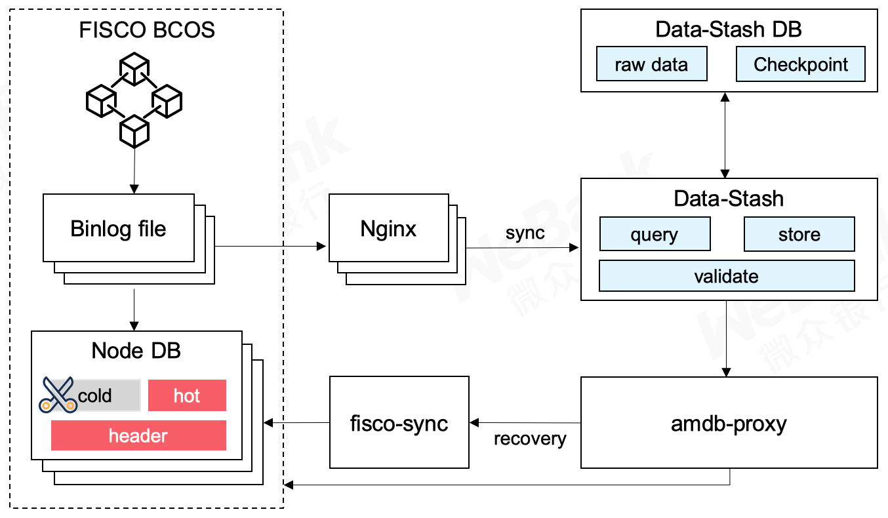

# 组件介绍

随着区块链业务不断运行，累积的海量链上数据会对区块链节点乃至网络的运维带来许多挑战。

从磁盘容量来看，由于节点的容量有限，持续膨胀的数据要求磁盘需要不断扩容。

从交易性能来看，过多的数据会带来交易执行性能的衰减。

从节点迁移来看，大量的数据同步会引起网络带宽被侵占、同步速度缓慢等问题。

针对以上挑战，微众银行区块链研发并开源了数据仓库组件Data-Stash，通过为节点在外部生成全量数据备份，解决海量数据治理的难题。

首先，节点通过数据裁剪实现冷热数据分离，链上仅保留热数据，冷数据则通过全量备份获取，如此可大量节省节点空间。同时，冷热数据分离后，交易的验证、执行仅依赖于链上热数据，从而提升交易执行性能。最后，对于新节点加入网络后数据的同步，只需要从全量备份拉取数据，实现数据高效迁移，其间不占用区块链网络带宽，免去冗长的同步过程，减少节点数据同步的等待时间，使得节点可以快速加入区块链网络并正常工作。

## 1. 关键特性
### 1） 节点账本全量备份
Data-Stash通过解析节点生成的Binlog，可以在节点外生成链上数据的全量备份。随后，节点运维人员可对链上数据进行裁剪，达到节省空间、提升性能的效果。对于裁剪后缺失的冷数据，节点会通过amdb从全量备份读取。节点还可以通过fisco-sync工具，将数据重新导回到节点，恢复完整的节点，而不必从区块链网络拉取数据。

### 2）多维度账本校验
数据仓库组件在读取某节点日志后，会进行多重校验，以防出现节点账本信息被损害、被篡改、共识系统异常等情况。
校验是多维度的，整体可分为对比校验和区块链校验。对比校验是指Data-Stash会拉取多个节点的账本进行对比，确认账本内容一致后才可以入库；区块链校验是指验证区块链本身，包括哈希检查、签名检查、状态根检查等。

### 3）备份数据可信存储
Data-Stash每处理完一个区块，都会为此时的全量备份生成一个哈希值作为检查点。该检查点会为存储增信，适用于全量备份库之间的校验等场景。例如，不同机构生成了各自的全量备份，现在想比对各自备份数据是否一致，各机构只需要提取出最新区块高度的检查点进行比对，如一致，则表示备份内容完全相同。

### 4）断点续传
在实际运行中，FISCO BCOS会生成许多binlog，这些binlog无论是大小、数量，都具有相当规模，如果每一次运行都重复下载、解析，会造成极大的性能浪费。为此，我们设计了断点续传机制，我们会持续记录解析的进度，每一次运行的时候都会从上一次断点处运行，而不会重新开始。
### 5）易于使用
使用者只需要做少量的配置，就可以运行。可以通过jar包直接运行，也可以通过bash脚本启动。
## 2. 使用场景
### 1） 冷热数据分离
随着时间推移，节点会积累越来越多的账本数据，如果节点体积不受控制的增长，最终会将节点服务器侵蚀殆尽，造成不良影响。对此，开发者可以使用数据仓库服务来实现冷热数据分离。

* 确保节点已经开启Binlog，如果节点未开启Binlog并已在运行，可先停止节点，删除群组数据、开启Binlog后再重启节点，节点即可重新同步并生成Binlog。
准备好一个第三方数据库，启动Data-Stash服务，将节点Binlog持续导入到该数据库中，实现全量备份备份。

* 开发者可对链上数据做一定的划分，可将节点上不常用数据删除，特别是对于存证这样关联性较弱的业务，可仅保留近期数据。

* 为了让节点运行不受影响，用户需要保证启用amdb（https://fisco-bcos-documentation.readthedocs.io/zh_CN/latest/docs/manual/data_governance.html#amdb-proxy），这样缺失的冷数据会自动从数据仓库读取，完成节点瘦身。

### 2） 实现节点高效迁移
在区块链业务运行时，经常有节点迁移或升级的需求。例如，服务器因为某些故障需要被下线回收，或者需要更换磁盘，此时需要对服务器或磁盘数据进行迁移，重新运行节点需要从区块链网络里同步数据，若待同步数据很大，例如几十G、几百G，就会使得数据恢复时间冗长，而且还会占满区块链的网络带宽，使得整个系统长时间停滞。开发者可通过Data-Stash组件，实现节点迁移。

* 开发者需要通过Data-Stash生成全量数据备份。

* 当需要节点迁移时，开发者可以通过FISCO BCOS项目下的fisco sync数据迁移工具（https://fisco-bcos-documentation.readthedocs.io/zh_CN/latest/docs/manual/data_governance.html#fisco-sync），将数据仓库导回到节点。这一过程不依赖于任何其他节点，所以迁移不会占用区块链的网络资源。

### 3） 监管、审计、追溯
对于监管方而言，要求账本数据完整、可查询，但区块链自身的账本数据库不一定满足该需求。例如出于节点瘦身、数据分片等需求，节点上可能仅存储部分账本数据；出于写性能的需要，区块链会选择rocksdb等数据库，但这类数据库在读性能上不具备优势。

此时，监管方可以对某个节点运行数据仓库服务导出完整的全量备份；同时由于我们采用了关系型数据库，易于查询；此外，在全量备份过程中，我们采用的多维度校验机制具有易于验证的优势，可防止节点运维恶意修改账本信息欺骗监管方，更好地满足监管需求。

