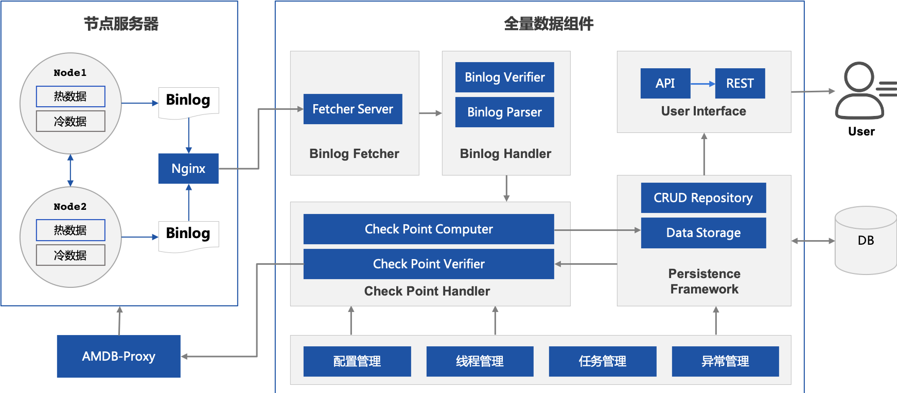

# 运行原理

## 1. 整体架构

（图需要优化）

整个体系分为如下部分：

- FISCO BCOS节点：该节点接入到区块链网络中，并将状态变化持续写入到binlog文件中
- Nginx：提供端口映射，使外界可以通过该端口访问到binlog文件
- 下载模块：通过Nginx轮询最新的binlog下载到本地
- 解析模块：解析binlog日志，解析出状态变更信息
- 验证模块：校验binlog中的数据
- 持久化模块：将binlog中的变动应用到数据库中，使得数据库成为节点的全量备份。并通过checkpoint进行增信。
- 清理模块：将已同步完的日志进行清理。

## 2. Binlog结构
一个BinLog记录了各区块对数据的信息。bBinLog文件会包含起始区块高度，例如"4.binlog"表示该日志的首个区块为4。
Fisco Bcos采用了BinLog内部记录了每个区块导致哪些系统表被改变。数据的变动按照表(table)-行(entry)-列（fields）的结构组织。。
BinLog的结构如下：

## 3. 存储模型

| 表 |表作用| 字段 | 字段说明 |
| --- | --- | --- | --- |
|_sys_config_|存储需要共识的群组配置项	|name,value,enable_num|配置名称，配置值，该条记录生效块高|
|_sys_cns_|存储合约名到地址的映射关系	|name,version,address,abi|合约名，合约版本，合约地址，合约ABI|
|_sys_consensus_|存储共识节点和观察节点的列表|name,type,node_id,enable_num|用于全量查询的标记，节点类型，节点ID，该条记录生效块高|
|_sys_current_state_|存储链最新的状态	|key,value|状态项（目前有current_number/total_transaction_count），状态值|
|_sys_table_access_|存储每个表的具有写权限的外部账户地址|table_name,address,enable_num|表明，账号地址，该条记录生效块高|
|_sys_tables_|存储所有表的结构|table_name,key_field,value_field|表名，表主key的列名，表其他列的列名|
|_sys_tx_hash_2_block_|存储交易hash到区块号的映射	|hash,value,index|交易hash，交易所在的区块号，区块中第几条交易|
|_sys_number_2_hash_|存储区块号到区块hash的映射	|number,value|区块号，区块hash|
|_sys_block_2_nonces_|存储区块中交易的nonces		|number,value|区块号，该区块中的nonce列表|
|_sys_hash_2_block_|存储区块hash到区块数据的映射	|key,value|区块hash，区块序列化数据|
|_sys_hash_2_header_|存储区块哈希对应的区块头数据|hash,value,sigs|区块hash，区块头序列号数据，签名列表|
|c_[合约地址]|存储外部账户信息|key,value|记录项（目前有balance/nonce/code/codeHash/alive），记录值|

## 4. 数据检查逻辑

全量数据服务会对binlog进行校验。校验分为两类：
- 横向数据校验
- 纵向数据校验

### 4.1. 横向数据校验

全量数据服务会从多个节点拉取binlog，并对这些binlog进行对比。针对每一个区块，校验内容包括：
- 区块高度相同
- 变动的表相同，包括表的数量和表名
- 每个表中的每一条记录(EntryInfo)都相同，包括检查每条行(ColumnInfo)都相同

### 4.2. 纵向数据校验

全量数据服务还会检测区块链数据本身，包括：

- blockHash：根据区块计算hash，看是否一致
- parentHash：区块能否链接到上一个区块
- sigList: 验证区块打包者的签名是否正确
- blockNumber：校验区块高度
- timestamp：校验区块时间
- transaction：根据blockLimit，判断是否超时
- stateRoot校验：transactions的stateRoot是否与header中一致

