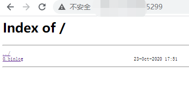

# 快速开始

## 1. 前置依赖

在使用本组件前，请确认系统环境已安装相关依赖软件，清单如下：

| 依赖软件 | 说明 |备注|
| --- | --- | --- |
| FISCO-BCOS | >= 2.6.0 | 需要为节点开启binlog选项|
| MySQL | >= mysql-community-server[5.7] | |
| Nginx | >= nginx[1.17.3]| |
| Java | JDK[1.8] | |
| Git | 下载的安装包使用Git | |

如果您还未安装这些依赖，请参考[附录](appendix.md)。

## 2. 基础设置

### 2.1. FISCO BCOS节点配置

由于全量数据服务用于生成节点的全量备份，所以要求节点拥有包括第一个区块在内的完整binlog日志，故需要确保该节点加入FISCO BCOS网络前就开启binlog生成选项。如果您的节点已经在运行中，请先停止该节点，并删除对应群组（以group1为例）的数据。例如：

```
[work@instance-zw7wgjv0 node0]$ bash stop.sh
 stop node0 success.
[work@instance-zw7wgjv0 node0]$ rm -rf data/group1

```

配置文件位于节点的conf/group.1.ini，请设置binary_log=true:

```
binary_log=true
```

配置完成后启动节点，使其加入FISCO BCOS网络：
```
[work@instance-zw7wgjv0 node0]$ bash start.sh
 node0 start successfully
```

启动成功后，即可在节点的data/group1/BinaryLogs目录下看到binlog，示例：

```
[work@instance-zw7wgjv0 node0]$ cd data/group1/BinaryLogs/
[work@instance-zw7wgjv0 BinaryLogs]$ ls
0.binlog
```

### 2.2. Nginx配置

FISCO BCOS节点的binlog日志存放在节点文件目录中，为了让外界能够访问这些binlog，现需要在节点所在服务器安装nginx并配置端口映射，这样外界即可根据该端口访问binlog。

若您还未安装nginx，请参考[附录](appendix.md)来安装nginx。

nginx配置文件位于/usr/local/nginx/conf/nginx.conf。需要在http模块内新增加一个server模块。在下面的模板中，请将端口号、服务器地址、binlog日志替换为实际的内容：

```
    server {
        listen       [端口号];
        server_name  [服务器地址];

        charset utf-8;
        location / {
            root   [binlog目录位置];
            index  index.html index.htm;
            autoindex on;
            autoindex_exact_size on;
            autoindex_localtime on;
        }

        error_page   500 502 503 504  /50x.html;
        location = /50x.html {
            root   html;
        }
    }
```

下面示例中，将5299端口映射到BinaryLogs目录：
```
    server {
        listen       5299;
        server_name  myhost.com;

        charset utf-8;
        location / {
            root   /home/work/fisco-bcos/nodes/127.0.0.1/node0/data/group1/BinaryLogs;
            index  index.html index.htm;
            autoindex on;
            autoindex_exact_size on;
            autoindex_localtime on;
        }

        error_page   500 502 503 504  /50x.html;
        location = /50x.html {
            root   html;
        }
    }
```

配置完成后，重启nginx使配置生效：

```
/usr/local/nginx/sbin/nginx -s stop
/usr/local/nginx/sbin/nginx -c /usr/local/nginx/conf/nginx.conf
/usr/local/nginx/sbin/nginx -s reopen 
```

这些操作完成后，可以通过浏览器访问该端口，出现类似下述响应即表示成功：



## 3. 运行全量数据服务

### 3.1. 下载源码

通过git 下载源码.

```
git clone https://github.com/WeBankBlockchain/Data-Elephant.git

```

### 3.2. 编译源码

```
cd Data-Elephant
./gradlew clean bootJar
```

编译完成后，会生成dist目录，其具备如下结构：
```
dist
│   start.sh
│   stop.sh
│   WeBASE-ETL-Bee.jar
└───config
│   │   application.properties
│   │   logback.xml
└───lib
    │   ...
```

### 3.3. 启动配置

在启动之间还需要进行配置，主要包括：
- FISCO BCOS节点binlog获取端口
- 数据库连接配置

需要在dist/config/application.properties中进行配置，示例如下：

```
### 配置nginx服务的binlog地址，如果连接多个节点的话，使用逗号分隔
system.binlogAddress=http://www.example.com:5299/,http://www.example.com:5300/


### 数据库连接配置
spring.datasource.url=jdbc:mysql://127.0.0.1:3306/etl?autoReconnect=true&characterEncoding=utf8&useSSL=false&serverTimezone=GMT%2b8
spring.datasource.username=root
spring.datasource.password=123456
spring.datasource.driverClassName=com.mysql.jdbc.Driver
```


如果您需要配置国密等需求，请见[详细配置](configuration.md)。

### 3.4. 运行程序

可以通过bash启动程序：
```
chmod +x *sh
bash start.sh
```
也可以直接通过jar包启动：
```
java -jar WeBASE-ETL-Bee.jar
```

如果日志出现下述字样，则表示运行成功：

```
2020-10-29 17:42:34.404  INFO 15044 --- [main] com.webank.etl.WeBaseEtlBeeApplication   : Starting WeBaseEtlBeeApplication on aaronchu-nb with PID 15044 (E:\gitee\WeBASE-ETL-Bee\dist\WeBASE-ETL-Bee.jar started by aaronchu in E:\gitee\WeBASE-ETL-Bee\dist)
2020-10-29 17:42:34.411  INFO 15044 --- [main] com.webank.etl.WeBaseEtlBeeApplication   : No active profile set, falling back to default profiles: default
2020-10-29 17:42:36.984  INFO 15044 --- [main] com.zaxxer.hikari.HikariDataSource       : HikariPool-1 - Starting...
2020-10-29 17:42:36.992  WARN 15044 --- [main] com.zaxxer.hikari.util.DriverDataSource  : Registered driver with driverClassName=com.mysql.jdbc.Driver was not found, trying direct instantiation.
2020-10-29 17:42:37.645  INFO 15044 --- [main] com.zaxxer.hikari.HikariDataSource       : HikariPool-1 - Start completed.
2020-10-29 17:42:41.420  INFO 15044 --- [main] o.s.s.c.ThreadPoolTaskScheduler          : Initializing ExecutorService 'taskScheduler'
2020-10-29 17:42:41.473  INFO 15044 --- [main] com.webank.etl.WeBaseEtlBeeApplication   : Started WeBaseEtlBeeApplication in 7.489 seconds (JVM running for 8.368)
2020-10-29 17:42:41.901  INFO 15044 --- [main] com.webank.etl.manager.DownloadManager   : Scan remote item 0, size: 1
2020-10-29 17:42:41.944  INFO 15044 --- [main] com.webank.etl.manager.DownloadManager   : Download start from last task: 0
........
```

```eval_rst
   .. admonition:: **注意事项**

    - 不要删除binlog的本地目录，也不要修改此目录下的binlog文件，否则会导致程序运行异常。
    - binlog目录下的binlog文件，建议在人工归档备份后再删除，以便于后续的维护和审计等工作。
    - 删除binlog的工作建议在服务停止的时候执行，以避免影响服务的正常运行。
    - 程序在运行失败后会自动退出，运维人员需要详细查看日志报错的原因，并人工介入。对不确定的问题，请联系并咨询开发人员。
```


