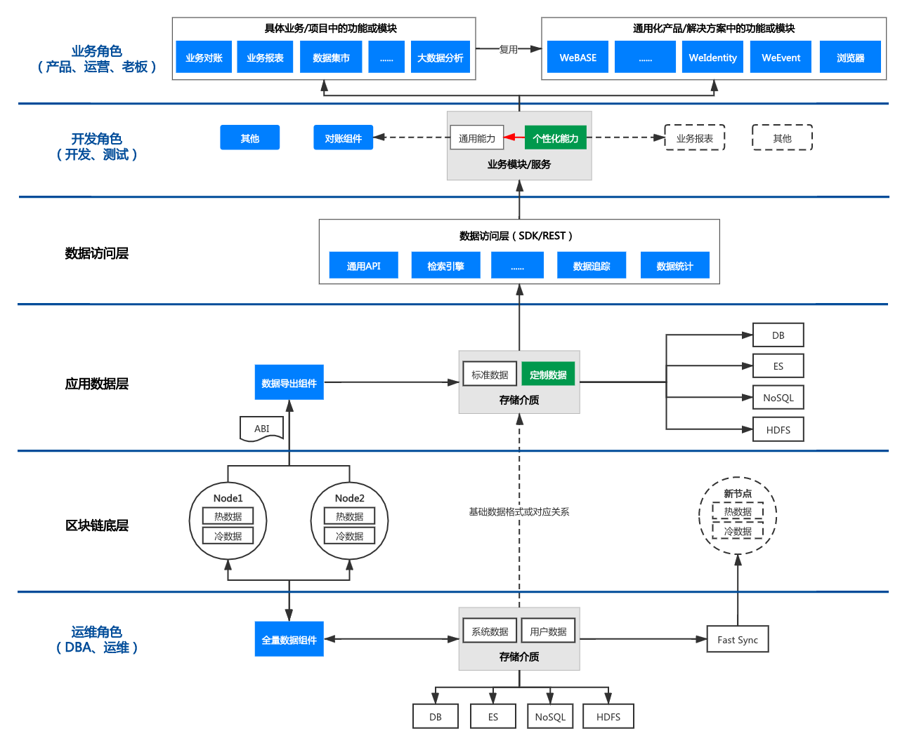

##############################################################
WeBankBlockchain-Data 技术文档
##############################################################

.. admonition:: 什么是 WeBankBlockchain-Data 

    WeBankBlockchain-Data 是一套稳定、高效、安全的区块链数据治理组件解决方案，可无缝适配FISCO BCOS区块链底层平台。
    它由数据导出组件(Data-Export)、数据仓库组件(Data-Stash)、数据对账组件(Data-Reconcile)这三款相互独立、可插拔、可灵活组装的组件所组成，开箱即用，灵活便捷，易于二次开发。

    这三个组件分别从底层数据存储层、智能合约数据解析层和应用层三个方面，提供了区块链数据挖掘、裁剪、扩容、可信存储、抽取、分析、审计、对账、监管等数据治理方面的关键能力。
    WeBankBlockchain-Data已在金融、公益、农牧产品溯源、司法存证、零售等多个行业落地和使用。

.. admonition:: 设计目标

    在区块链底层和区块链生产应用之间，横亘着一条区块链技术、业务和产品的鸿沟。

    区块链数据治理的成本较高。首先，区块链节点的数据一般以Key-Value的形式存储于文件数据库，通常只能通过智能合约的接口来获取和调用，较难抽取、分析和处理。
    同时，区块链节点的数据还存在着扩容瓶颈，冷热数据切分困难。最后，区块链链上的数据需要经过多方共识，链上计算和处理的开销巨大。
    而区块链生产应用的开发者从了解区块链到完成开发，需要经历陡峭的学习曲线，花费较多的时间和精力。

    WeBankBlockchain-Data 定位为区块链数据治理组件，旨在通过关注区块链数据的计算和存储的不变，抓住数据治理的本质，使得区块链生产应用的开发者即便在不了解区块链的细节的场景下，也可以轻松、顺畅地管理、使用区块链数据，提供开箱即用和一站式的友好体验。

.. admonition:: 组件简介

    - **WeBankBlockchain-Data-Stash  数据仓库组件** 
    提供FISCO BCOS节点数据扩容、备份和裁剪的能力。
    可基于binlog协议同步区块链底层节点数据，支持断点续传，数据可信验证，并提供快速同步机制。
    请参考  `Github地址 <https://github.com/WeBankBlockchain/Data-Stash>`_ 
    `Gitee地址 <https://gitee.com/WeBankBlockchain/Data-Stash>`_
    `文档 <https://data-doc.readthedocs.io/zh_CN/latest/docs/WeBankBlockchain-Data-Stash/index.html>`_
    `快速开始 <https://data-doc.readthedocs.io/zh_CN/latest/docs/WeBankBlockchain-Data-Stash/quickstart.html>`_

    - **WeBankBlockchain-Data-Export  数据导出组件** 
    支持将链上数据导出到MySQL等结构化存储中，解决区块链数据复杂查询、分析和处理的问题。
    只需简单配置、无需开发、即可实时导出个性化的业务数据，实现将裸数据转化为标准化、结构化、有序化、可视化的高价值数据。
    请参考  `Github地址 <https://github.com/WeBankBlockchain/Data-Export>`_ 
    `Gitee地址 <https://gitee.com/WeBankBlockchain/Data-Export>`_
    `文档 <https://data-doc.readthedocs.io/zh_CN/latest/docs/WeBankBlockchain-Data-Export/index.html>`_
    `快速开始 <https://data-doc.readthedocs.io/zh_CN/latest/docs/WeBankBlockchain-Data-Export/install.html>`_
    
    - **WeBankBlockchain-Data-Reconcile  数据对账组件**
    提供区块链数据的对账解决方案。
    灵活配置、无需开发，支持自定义对账数据和对账格式，支持定时对账和触发对账，对账处理模块可插拔可扩展。
    请参考  `Github地址 <https://github.com/WeBankBlockchain/Data-Reconcile>`_ 
    `Gitee地址 <https://gitee.com/WeBankBlockchain/Data-Reconcile>`_
    `文档 <https://data-doc.readthedocs.io/zh_CN/latest/docs/WeBankBlockchain-Data-Reconcile/index.html>`_
    `快速开始 <https://data-doc.readthedocs.io/zh_CN/latest/docs/WeBankBlockchain-Data-Reconcile/install.html>`_

.. important::
    FISCO-BCOS 2.0与3.0对比、JDK版本、WeBankBlockchain-Data及其他子系统的 `兼容版本说明 <https://fisco-bcos-documentation.readthedocs.io/zh_CN/latest/docs/compatibility.html>`_

.. admonition:: 总体设计

    下图是数据治理组件使用的全景图。

.. admonition:: 使用场景

    企业级区块链应用存在多元化角色参与，诸如业务角色、运营人员、开发角色、运维角色等。针对区块链数据，每一个特定的角色都有着不同的数据治理诉求。WeBankBlockchain-Data分别从区块链底层节点数据维护、应用数据处理和业务数据应用三个维度，抽象、设计了对应的组件来满足不同角色的对数据治理的需求。

    - **场景1：节点数据维护**

    数据仓库组件Data-Stash是一款针对区块链节点数据处理的轻量化、高安全、高可用组件，主要面向运维人员和开发人员。

    数据备份：Data-Stash可以通过Binlog协议对区块链节点数据进行准实时全量备份，区块链节点可以根据实际情况进行冷热数据裁剪和分离，在确保数据安全可信的基础上，解决节点扩容问题，降低开发和硬件成本。在解决节点扩容问题的同时，可以使得节点“轻装上阵”，不仅能够减少节点空间的开销，而且能够有效提升节点执行交易的性能。

    数据同步：对于加入区块链网络的新节点，可以通过Data-Stash，在Fisco Sync工具的配合下，快速同步区块链网络的数据，确保节点以最快的速度参与到区块链网络的“工作”中，降低新节点因等待数据同步而造成的时间浪费。

    - **场景2：应用数据处理**

    数据导出组件Data-Export 提供了导出的区块链标准数据、自动基于智能合约代码智能分析而生成的定制数据，存储到MySQL和ElasticSearch等存储介质中，主要面向开发人员。

    复杂查询与分析：现有区块链对查询功能不太友好，且链上计算非常宝贵，Data-Export支持将链上存储的区块链数据导出到链下的分布式存储系统中。开发者可以基于已导出的区块链系统基础数据，智能合约部署合约账户、事件和函数等数据，进行二次开发，定制复杂查询和数据分析的逻辑，快速实现业务需求。例如，开发者可对交易明细根据业务逻辑进行统计和关联查询分析，开发各类反洗钱和审计监管报表等等。

    区块链数据可视化：Data-Export会自动生成Grafana的配置文件，无需开发，即可实现区块链数据可视化。区块链数据可视化不仅能够作为区块链数据大盘、数据查看、运营分析的工具，同时也可以运用在应用开发、调试、测试阶段，以可见即可得的方式提升研发体验和效率。此外，Data-Export还提供了Restful API供外部系统集成。运维人员可以通过Grafana实时监控业务系统的状态，业务人员可以在集成后的业务后台系统上获得该业务的实时进展。

    区块链中间件平台WeBASE的数据导出子系统已经整合了Data-Export，同时，Data-Export也可以独立与区块链底层集成，以灵活地支持业务需求，迄今已在数十个生产系统中稳定、安全运行。

    如今，Data-Export作为区块链数据治理的关键组件，以开源形式发布，由社区伙伴通力完善，以适应更多的使用场景、打造更多的功能。

    - **场景3：业务数据应用**

    在业务层，数据对账是区块链交易系统中最常见的场景之一。基于数个区块链DAPP应用的开发和实践经验，我们封装和开发了数据对账组件Data-Reconcile，提供基于区块链智能合约账本的通用化数据对账解决方案，并提供了一套可动态延展的对账框架，支持定制化开发，主要面向开发人员，为业务人员提供服务。

    企业内部对账：Data-Reconcile支持企业内部系统之间的对账，例如区块链链上数据与链下业务系统之间的对账。开发人员可以利用Data-Reconcile快速进行二次开发，将业务系统数据和链上数据进行核算比对，保证了企业内部业务系统数据的可靠和运行安全。

    企业间对账：Data-Reconcile可以帮助开发者快速构建跨机构间的对账应用系统。例如，在结算时，A企业定期将自身业务系统交易数据导出为对账文件，发送至与文件存储中心。B企业可借助Data-Reconcile定期拉取A企业对账文件，配合Data-Export，与企业内部的链上数据进行对账处理。Data-Reconcile在保证对账结果可信的同时提升了对账的效率，可实现准实时对账。

.. toctree::
   :hidden:
   :maxdepth: 3
   :caption: 组件介绍

   ./docs/WeBankBlockchain-Data-Stash/index.md
   ./docs/WeBankBlockchain-Data-Export/index.md
   ./docs/WeBankBlockchain-Data-Reconcile/index.md
   ./docs/all_projects.rst
.. 

 
 
